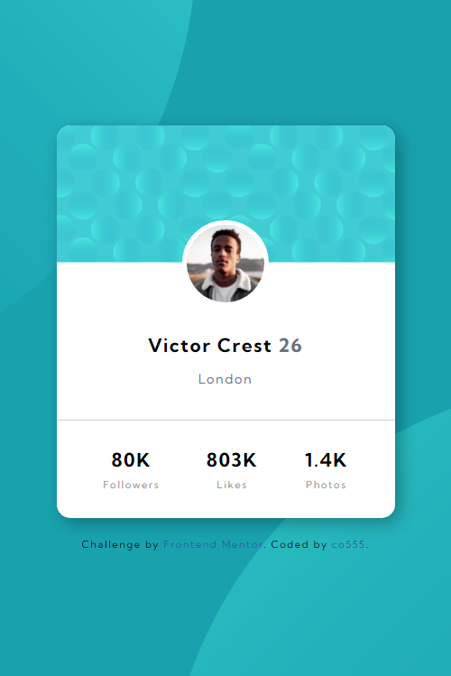

# Frontend Mentor - Profile card component solution

This is a solution to the [Profile card component challenge on Frontend Mentor](https://www.frontendmentor.io/challenges/profile-card-component-cfArpWshJ). Frontend Mentor challenges help you improve your coding skills by building realistic projects. 

### Screenshot

Desktop view:

Mobile view:

### Links

- Solution URL: https://www.frontendmentor.io/solutions/profilecardcomponent-PzmLVUimT
- Live Site URL: https://co555.github.io/profile-card-component/

## My process

### Built with

- Flexbox
- Mobile-first workflow

## Author

- Website - https://github.com/co555?tab=repositories
- Frontend Mentor - https://www.frontendmentor.io/profile/co555
